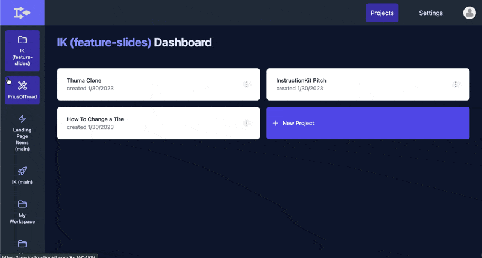

# InstructionKit

InstructionKit is a collaborative workspace for designing and deploying user flows. Each project lives on a canvas with rich-text editors, logical connectors and javascript execution.

InstructionKit was designed originally for instructions and guides for complex physical products, but was expanded as a generic tool for any kind of interactive user-flow.

> **Status:** archived. This was a startup project built in 2022–2023 and is no longer
> actively developed. It's public as a code sample.



## Design

- **Local-first sync.** State lives in [Replicache](https://replicache.dev) and syncs through
  a Postgres backend, so edits apply instantly against a local cache and reconcile with the
  server in the background. Mutators are defined once and run on both client and server.
- **A document that is also a graph.** `Flow` nodes (`start`, `branch`, `sub`, `ref`) carry
  canvas positions for [React Flow](https://reactflow.dev) and rich text for
  [TipTap](https://tiptap.dev); `Dart` edges (`goto`, `incl`, `async`) carry the control flow.
  The same structure renders as an editable diagram and as a step-by-step reader view.
- **Runtime-validated schema.** Every domain type in [`src/model/schema`](src/model/schema)
  is a [Zod](https://zod.dev) schema with the TypeScript type inferred from it, so the wire
  format and the compile-time types can't drift apart.
- **Text as a small language.** [`src/model/postProcess`](src/model/postProcess) compiles the
  editor's rich text into the structure the reader view executes — custom TipTap nodes plus a
  post-processing pass over the resulting tree.
- **Explicit state machines.** Editor and loading states are modeled with
  [XState](https://xstate.js.org) rather than ad-hoc booleans.

## Layout

```
pages/                    Next.js routes (pages router)
  [workspaceId]/          workspace → project → editor + preview
  guide/                  the published, reader-facing guide view
  playground/             editor sandbox, no account required
  api/replicache/         sync endpoints
src/
  model/schema/           Zod domain types (workspace, project, floem, flow, dart, …)
  model/persistence/      Replicache spaces & mutators, Supabase, filesystem, URL state
  model/postProcess/      rich text → executable guide structure
  components/views/       app + marketing UI
  lib/route/              routing helpers
```

## Running it locally

Requires Node >= 22.

```bash
npm install
npm run dev
```

You'll need a `.env.local` with:

| Variable                                                      | Purpose                             |
| ------------------------------------------------------------- | ----------------------------------- |
| `NEXT_PUBLIC_SUPABASE_URL`                                    | Supabase project URL                |
| `NEXT_PUBLIC_SUPABASE_ANON_KEY`                               | Supabase anon key                   |
| `SUPABASE_DATABASE_PASSWORD`                                  | used by the Replicache backend      |
| `DATABASE_URL`                                                | Postgres connection string for sync |
| `NEXT_PUBLIC_REPLICACHE_LICENSE_KEY`                          | Replicache license key              |
| `AIRTABLE_API_KEY`, `AIRTABLE_BASE_ID`, `AIRTABLE_TABLE_NAME` | waitlist form only                  |

The Supabase migrations aren't included in this repo. The table shapes the app expects are
in [`src/model/persistence/supabase/database.types.ts`](src/model/persistence/supabase/database.types.ts)
— `client`, `entry`, `meta`, `profiles` and `space` — which is enough to recreate the schema.

### Heads up: one dependency is paid

`@tiptap-pro/extension-unique-id` is a commercial [Tiptap Pro](https://tiptap.dev/pricing)
package served from a private registry. Without a Tiptap Pro account and an `.npmrc` token,
`npm install` will fail on that package. Everything else installs from the public registry.

## License

[GNU AGPL v3](LICENSE). You're free to read, run, modify, and share this; if you deploy a
modified version as a network service, you have to publish your source too.

Copyright © 2022–2026 Daniel Sosebee. As the copyright holder I retain the right to license
this code under other terms — contact me if AGPL doesn't work for your use case.
